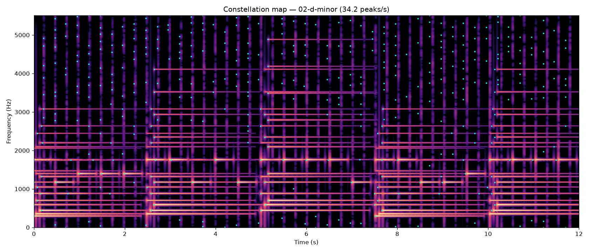
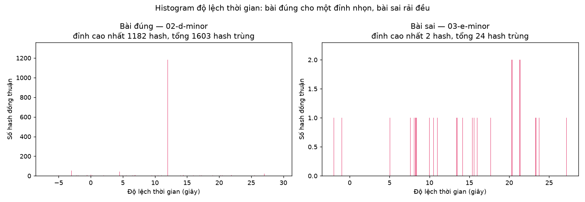

# Thuật toán nhận diện nhạc

Giải thích năm bước biến một đoạn thu ngắn thành tên bài hát, theo Wang (2003).
Mọi con số ở đây là số đo thật trên mã trong repo này.

## Bài toán: vì sao không so khớp trực tiếp dạng sóng

Đoạn thu của người dùng và bản gốc trong kho là *cùng một bài*, nhưng dạng sóng
của chúng gần như không có điểm chung:

- **Lệch thời gian.** Đoạn thu bắt đầu ở một chỗ bất kỳ trong bài.
- **Nhiễu phòng.** Tiếng nói chuyện, điều hoà, tiếng ghế.
- **Đáp ứng của loa và micro.** Mỗi thiết bị nhấn mạnh một vùng tần số khác nhau.
- **Nén mất mát.** MP3 vứt bỏ những gì tai người khó nghe thấy, và vứt khác nhau
  ở mỗi lần mã hoá.
- **Lệch pha.** Chỉ cần dịch nửa chu kỳ là hiệu hai tín hiệu đã lớn bằng chính
  tín hiệu.

Vậy nên cần một biểu diễn **thưa** và **bền**: giữ lại thứ sống sót qua tất cả
những biến dạng trên, vứt bỏ phần còn lại. Đó là ý tưởng constellation map.

## Bước 1 — Chuẩn hoá và hạ tần số lấy mẫu

`src/shazam/audio.py`

Mọi tín hiệu vào đều bị đưa về **mono, 11 025 Hz, biên độ đỉnh 1,0**.

**Vì sao 11 025 Hz.** Đó đúng bằng 44100/4, nên với nhạc CD thì đây là phép chia
hệ số nguyên. Nyquist còn 5512 Hz — đủ phủ vùng năng lượng chính của nhạc, trong
khi số mẫu phải xử lý giảm bốn lần.

**Vì sao phải lọc trước khi hạ mẫu.** Bỏ bớt mẫu mà không lọc thì mọi thành phần
trên Nyquist mới bị *gập* (alias) xuống dải nghe được thành các tần số ma. Chúng
không có thật, nhưng peak picking vẫn sẽ bắt lấy, và vân tay sẽ chứa thông tin
bịa ra.

**Chỉ một bộ lọc duy nhất, cho mọi tần số vào.** Bản cài đầu tiên dùng
`scipy.signal.decimate` cho tỷ lệ nguyên và `resample_poly` cho phần còn lại. Đo
lại thì thấy hai đường khác nhau rõ rệt:

| Tần số | `decimate` (kho, 44,1 kHz) | `resample_poly` (query, 48 kHz) |
|---|---|---|
| 4400 Hz | −0,07 dB | +0,02 dB |
| 4800 Hz | **−12,00 dB** | −0,21 dB |
| 5000 Hz | **−23,80 dB** | −0,83 dB |

`decimate` mặc định dùng IIR Chebyshev-I bậc 8 cắt từ khoảng 4,4 kHz — thấp hơn
hẳn Nyquist 5512 Hz. Kho là 44,1 kHz còn trình duyệt gửi 48 kHz, nên **mọi query
đều bị lệch so với mọi bài trong kho ở dải 4,4–5,5 kHz**. Hệ thống vẫn "chạy",
chỉ nhận diện kém đi. Nay dùng `resample_poly` cho tất cả: với 44100 → 11025 nó
tự rút gọn theo GCD thành up-1/down-4, vẫn là phân chia hệ số nguyên.

## Bước 2 — STFT tự cài

`src/shazam/stft.py`

Cắt tín hiệu thành các khung chồng lấp, nhân cửa sổ, rồi FFT từng khung:

$$X[k, m] = \sum_{n=0}^{N-1} x[n + mH] \cdot w[n] \cdot e^{-j 2\pi k n / N}$$

với $N = 1024$ (cửa sổ), $H = 256$ (bước nhảy), $w$ là cửa sổ Hann.

```python
all_windows = np.lib.stride_tricks.sliding_window_view(signal, window_size)
frames = all_windows[::hop_size]

window = np.hanning(window_size).astype(np.float32)
spectrum = np.fft.rfft(frames * window, axis=-1)
```

**Đánh đổi thời gian ↔ tần số.** Cửa sổ dài cho phân giải tần số mịn nhưng
"nhoè" thời gian, và ngược lại. 1024 mẫu ở 11 025 Hz là 92,9 ms, cho độ phân
giải 10,77 Hz — đủ tách các hoạ âm của nốt nhạc liền kề.

**Vì sao cửa sổ Hann.** Cắt khung tức là nhân với cửa sổ chữ nhật, mà phổ của nó
là hàm sinc với búp phụ tắt rất chậm. Một tông không nằm đúng tâm bin sẽ rò năng
lượng ra khắp phổ (*spectral leakage*) và chôn mất các đỉnh nhỏ. Hann vuốt biên
khung về 0, đổi búp chính rộng hơn một chút lấy búp phụ thấp hơn nhiều.

**Vì sao `rfft`.** Tín hiệu âm thanh là thực, nên phổ đối xứng liên hợp: nửa
trên không mang thêm thông tin gì. `rfft` chỉ trả bin 0..N/2 — 513 bin thay vì
1024, giảm nửa cả tính toán lẫn bộ nhớ.

**Chuẩn hoá theo độ lợi cửa sổ.** Biên độ `rfft` thô mang sẵn hệ số `sum(w)/2`
≈ 256 (+48 dB), và hệ số này *đổi theo độ dài cửa sổ*. Chia nó ra thì sin toàn
thang đọc đúng 1,0, và ngưỡng dB có nghĩa cố định bất kể `window_size`.

**Kiểm chứng:** sin 440 Hz cho đỉnh ở bin 41 (= 441,4 Hz), đúng như tính toán
440/10,77 = 40,9. Có test cho cả đường 44,1 kHz lẫn 48 kHz.


## Bước 3 — Lọc đỉnh phổ

`src/shazam/peaks.py`

Giữ lại các điểm là cực đại cục bộ trong hộp 20 bin × 20 khung **và** vượt ngưỡng
`peak_min_db`:

```python
spectrum_db = 20.0 * np.log10(magnitude + LOG_EPSILON)
local_maxima = maximum_filter(spectrum_db, size=neighborhood, mode="constant", cval=-np.inf)
is_peak = (spectrum_db == local_maxima) & (spectrum_db > config.peak_min_db)
```

**Vì sao đỉnh sống sót còn biên độ thì không.** Loa, micro và bộ nén đều thay
đổi *độ lớn* của các thành phần tần số, nhưng hiếm khi làm một thành phần yếu
vượt lên trên hàng xóm mạnh hơn nó. *Vị trí* của cực đại cục bộ vì thế bền hơn
hẳn giá trị tuyệt đối.

**Epsilon trước khi lấy log là bắt buộc.** `log10(0)` là `-inf`. Trên khung im
lặng, mọi điểm đều bằng `-inf`, nên mọi điểm đều "bằng cực đại lân cận" và cả
khung bị báo là đỉnh. Đo trên spectrogram im lặng 50×50: **2500/2500 đỉnh giả
khi không có epsilon, 0 khi có**. Epsilon làm im lặng thành hữu hạn (−200 dB) để
ngưỡng loại được nó — chứ bản thân nó không phá thế hoà.

Kết quả là **constellation map**: danh sách thưa các điểm `(khung, bin tần số)`.
Đo trên kho hiện tại: 34 đỉnh/giây.



## Bước 4 — Ghép cặp đỉnh và băm

`src/shazam/hashing.py`

**Vì sao không băm từng đỉnh một.** Một đỉnh chỉ có ~10 bit thông tin (bin nào).
Với kho lớn thì mỗi hash trùng hàng nghìn bài — vô dụng.

Cách giải: ghép mỗi đỉnh *neo* với vài đỉnh phía sau nó trong "vùng đích", rồi
băm **cặp**:

```
constellation:  ·    ·  ·       ·
                ↑ neo
                └──Δt──▶ đích

hash  = (f1 << 22) | (f2 << 12) | Δt_frames
value = (song_id, t_neo)
```

**Vì sao dùng hiệu thời gian chứ không phải thời gian tuyệt đối.** Đoạn thu bắt
đầu ở đâu trong bài là chuyện ngẫu nhiên. Nếu hash phụ thuộc thời điểm tuyệt đối
thì không bao giờ khớp. Hiệu `Δt` giữa hai đỉnh thì **không đổi** dù đoạn thu cắt
ở đâu — đó chính là tính bất biến với dịch thời gian. Thời điểm tuyệt đối vẫn
được lưu, nhưng lưu riêng làm *giá trị*, và bước 5 dùng nó.

**Độ chọn lọc.** 10 + 10 + 12 bit = 32 bit, tức khoảng 4,3 tỷ giá trị khác nhau.
Với `fan_out = 8`, mỗi đỉnh sinh tối đa 8 hash. Đo thật: 2 672 hash cho 10 giây
audio.

**Cạm bẫy đã gặp: `BIGINT` chứ không phải `INTEGER`.** Cửa sổ 1024 cho 513 bin,
nên bin neo tối đa là 512, và `512 << 22 = 2 147 483 648` — vượt đúng 1 đơn vị
so với trần `INTEGER` có dấu của PostgreSQL. Dùng `INTEGER` sẽ chỉ hỏng những
vân tay neo ở **đúng bin trên cùng**, còn 99,8% dữ liệu vẫn đúng: một loại hỏng
cục bộ, phụ thuộc phổ, và cực khó truy ra.

## Bước 5 — Khớp bằng histogram độ lệch

`src/shazam/matcher.py`

Trùng hash **không** chứng minh điều gì: các hợp âm phổ biến va nhau khắp nơi.
Thứ chứng minh là **sự đồng thuận**: nếu đoạn thu đúng là trích từ bài X ở giây
thứ 47, thì *mọi* hash chung phải cho cùng một hiệu `t_kho − t_query`. Trùng ngẫu
nhiên thì rải đều.



Ảnh trên là cùng một query, đối chiếu với hai bài. Bài đúng: 1 182 hash cùng chỉ
về độ lệch 12,0 giây — đúng chỗ đoạn thu được cắt ra. Bài sai: 24 hash trùng,
rải khắp trục, cao nhất chỉ 2.

**Điểm số là số hash *khác nhau* đồng thuận**, không phải số lần trùng. Đếm số
lần trùng thì một hash lặp đi lặp lại trong query — tiếng ngân dài, một vòng lặp,
tiếng gõ nhịp — tự nó chất đủ phiếu để vượt ngưỡng và khớp bừa vào bất kỳ bài nào
có cùng mẫu lặp đó.

**Hai điều kiện phải cùng thoả để chấp nhận:**

1. `score >= min_score` (mặc định 10)
2. `score / score_á_quân >= 2.0`

Chỉ lấy đỉnh cao nhất thì hệ thống **luôn** trả về một bài nào đó, kể cả khi
query là tiếng ồn trắng. Trả về "không tìm thấy" là một câu trả lời thật, và nó
tốt hơn một câu trả lời sai tự tin — người nghe không phân biệt được đâu là đâu.

## Hạn chế đã biết

- **Không nhận được cover, hát lại, remix.** Vân tay bám vào đúng *bản ghi* cụ
  thể, không phải vào giai điệu. Một bản thu khác của cùng bài là một bài khác.
- **Nhạy với thay đổi tốc độ phát.** Đổi tốc độ làm dịch cả trục tần số lẫn trục
  thời gian, nên hash không còn khớp.
- **Bài phải có sẵn trong kho.** Không có khả năng khái quát hoá.
- **Nhiễu quá lớn thì mất đỉnh.** Khi nhiễu vượt lên trên các thành phần nhạc,
  cực đại cục bộ đổi chỗ và vân tay đổi theo.

Ba hạn chế đầu là hệ quả trực tiếp của thiết kế, không phải lỗi cài đặt — cái
làm cho vân tay bền trước nhiễu cũng chính là cái làm nó không khái quát được.

## Nguồn

Wang, A. (2003). *An Industrial-Strength Audio Search Algorithm*. ISMIR.
